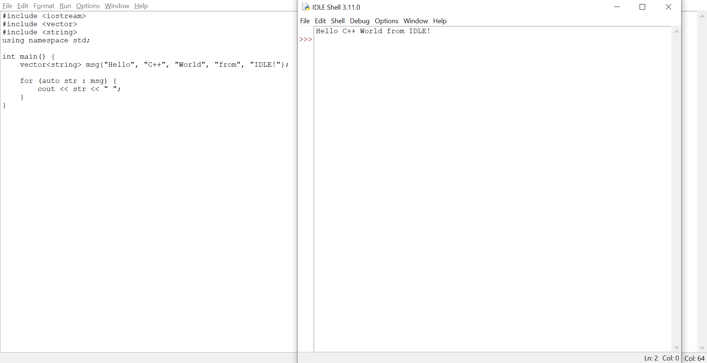
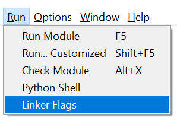
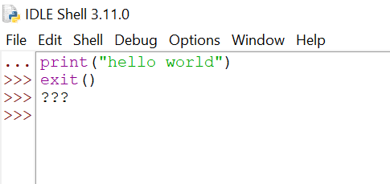
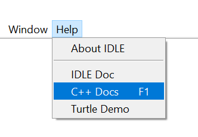

## Introduction

This project contains modified IDLE source code that removes all Python functionality and converts it into a C++ IDE.

## Requirements

[g++](https://www.msys2.org/)

## Installation
1. Locate the IDLE source code directory
    - `C:\Users\USERNAME\AppData\Local\Programs\Python\PythonXXX\Lib\idlelib`
    - The Python version is the one that your IDLE uses, and can be checked by running the IDLE Python shell
2. Add the files in this repository into the directory
3. Restart IDLE to apply changes

## Features

### Compiling C++ code

The `Run Module` option in IDLE compiles and runs your program with g++, instead of calling its Python interpreter.

### Linker flags

Linker flags can also be included in your program's compilation.  

This option in the dropdown menu creates a `linker_flags.txt` file in your project folder, where you can include a line-separated list of libraries to link against.

### Removal of Python Shell

The Python shell is completely disabled, and is solely for console outputs from your program.

### C++ Documentation

The documentation button redirects you to https://en.cppreference.com now.